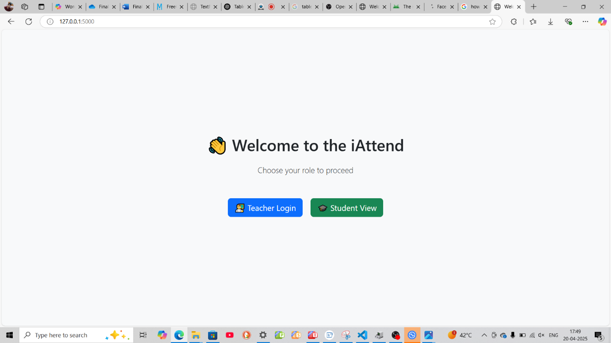
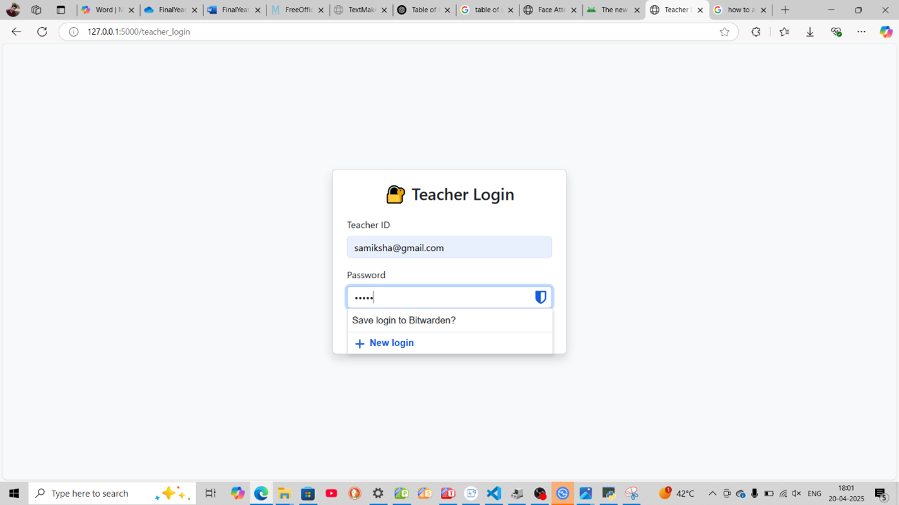
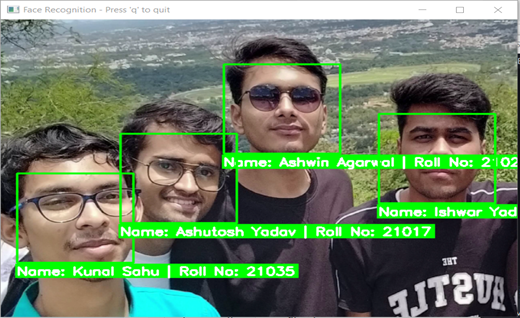
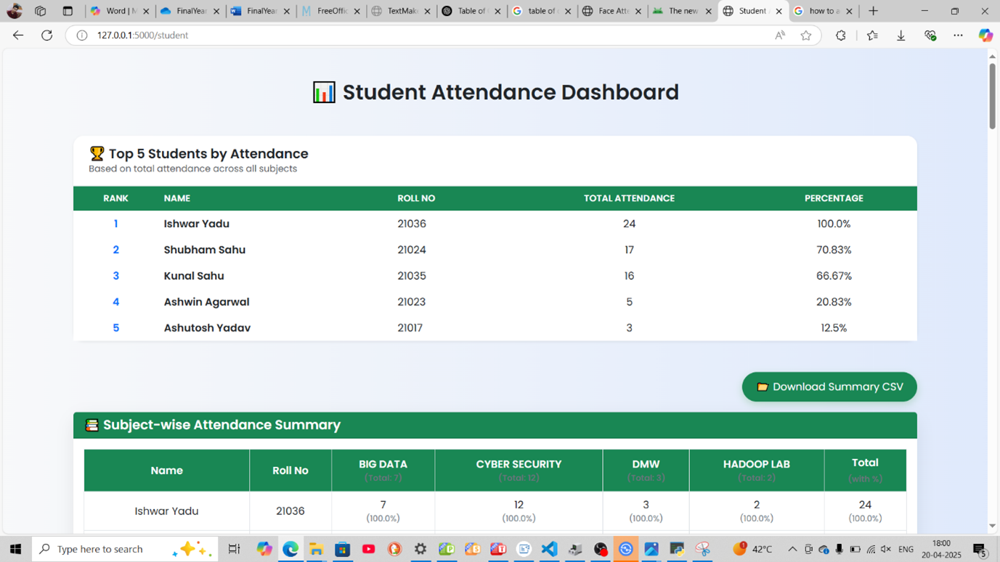
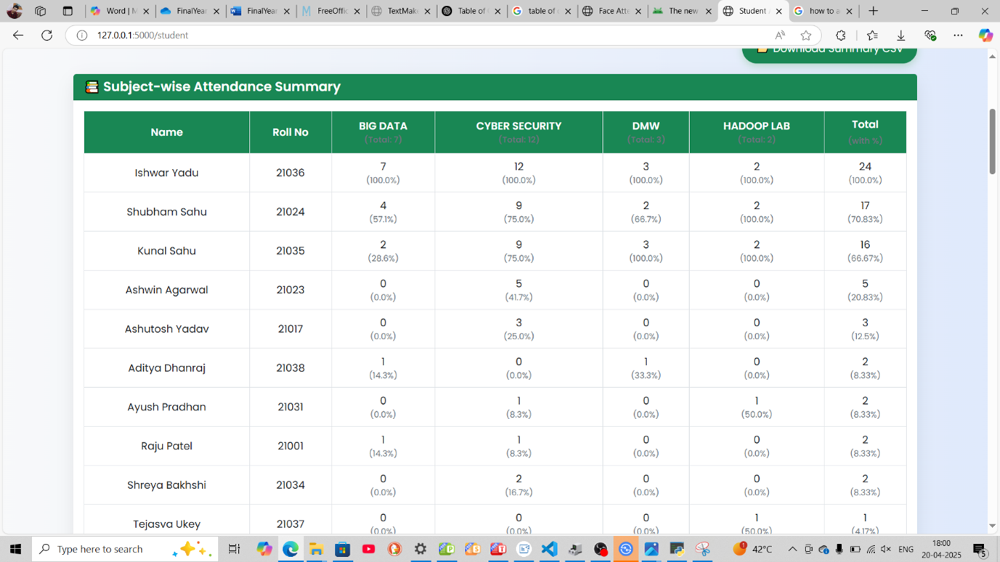
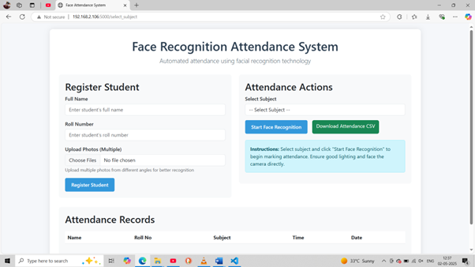
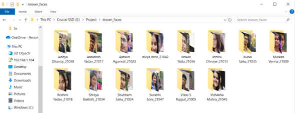
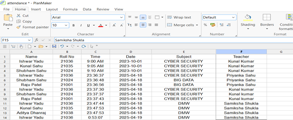

# 📸 iAttend – Intelligent Face Recognition Attendance System

**iAttend** is a real-time, face recognition–based attendance management system designed for educational institutions. Built using Python, Flask, OpenCV, and `face_recognition`, the system allows contactless, secure, and accurate attendance logging with subject-level and teacher-level data separation.

> 🧠 Powered by computer vision and machine learning  
> 🧾 Transparent attendance tracking  
> 🎓 Developed as a B.Tech Final Year Project (2024-25)

---

## 📌 Features

- 🎯 **Face Recognition Attendance**  
  Uses webcam and facial embeddings to detect and verify student identity.

- 🔐 **Teacher Authentication**  
  Teachers must log in before starting an attendance session.

- 🧑‍🏫 **Subject-wise Logging**  
  Attendance data includes subject name and teacher identity.

- 📊 **Dynamic Dashboards**  
  Students can view their subject-wise attendance summaries.

- 💾 **CSV-Based Logging**  
  Attendance records are stored in a structured CSV format for portability.

- 🧮 **Performance Tested**  
  > 95%+ accuracy in well-lit conditions with sub-1 minute session times for 30 students.

---

## 🛠️ Tech Stack

| Component             | Technology Used                      |
|----------------------|---------------------------------------|
| Backend              | Python, Flask                        |
| Face Recognition     | `face_recognition`, dlib, OpenCV     |
| Frontend             | HTML, CSS (Jinja2 templates)         |
| Data Storage         | CSV, Pickle (`.pkl`)                 |
| Visualization        | pandas, numpy                        |
| Deployment           | Localhost Flask Server               |

---

## 📸 Screenshots

- iAttend Landing Page  
- Teacher Login Section  
- Live Face Recognition Window  
- Student Attendance Dashboard  
- Subject-wise Attendance Summary  
- Teacher Panel for Attendance 
- Image Database Folder 
- Attendance Logging in CSV File 

---

## 🧪 Performance Summary

| Condition                | Accuracy (%) | FAR (%) | FRR (%) |
|--------------------------|--------------|---------|---------|
| Bright Indoor Lighting   | 98.6         | 0.4     | 1.0     |
| Dim Lighting             | 92.3         | 0.7     | 6.9     |
| Wearing Glasses          | 94.7         | 1.0     | 4.3     |
| Side/Partial View        | 85.2         | 3.2     | 11.6    |

- ✅ Real-time face matching speed: ~0.6–1.2s/frame  
- 🧾 CSV I/O latency: < 0.05s per entry  
- 📈 Average full session time (30 students): ~50 seconds

---

## 🧰 Setup Instructions

1. **Clone the repository**  
   ```bash
   git clone https://github.com/kunalsahuu/iAttend.git
   cd iAttend/Project
   ```

2. **Install dependencies**
   ```bash
   pip install -r requirements.txt
   ```

3. **Run the application**
   ```bash
   python final.py
   ```

4. **Access in browser**
   ```
   http://127.0.0.1:5000
   ```

- face_recognition requires dlib, which needs CMake and Visual Studio Build Tools on Windows. If you face errors, you may need to install it via wheel: (further problems should be solved using youtube videos)
  ```
  pip install cmake
  pip install dlib
  pip install opencv-contrib-python
  ```

---

## 📂 Folder Structure

```
iAttend/Project
├── face_recognition_model     # Contains library files
├── final.py                   # Main Flask server
├── templates/                 # HTML templates (Jinja2)
├── static/                    # CSS, JS, media files
├── known_faces/               # Student images
├── encodings.pkl              # Stored facial encodings
├── attendance.csv             # Attendance records
├── requirements.txt           # Python dependencies
```

---

## 🚧 Limitations & Future Work

### Known Limitations:
- ❌ No liveness detection (vulnerable to spoofing with images)
- 💡 Sensitive to lighting and face orientation
- 🖥️ Local-only storage (no cloud or database integration)
- ❌ Not yet mobile responsive or PWA-enabled

### Future Improvements:
- 🔍 Add blink/movement-based liveness detection
- ☁️ Cloud hosting (Firebase/AWS/GCP)
- 📱 Mobile App Companion (Android/iOS)
- 🧠 Automatic face re-encoding (aging, beard, etc.)
- 🔗 LMS/SIS integration via REST APIs
- 🎓 Admin panel for data cleanup and analytics

---

## 👥 Team

Project by Final Year IT students at **Government Engineering College, Bilaspur** (Affiliated to CSVTU, Bhilai):

- **Kunal Sahu**  
- Shubham Sahu  
- Shreya Bakhshi  
- Ishwar Yadu  
Under the guidance of **Prof. Samiksha Shukla**

---

## 📃 License

This project is licensed under the [MIT License](LICENSE).

---

> ⭐ *If you find this project useful, give it a star on GitHub!*  
> 📬 For queries or collaborations, feel free to [reach out](mailto:kunalsahu.in@gmail.com)
